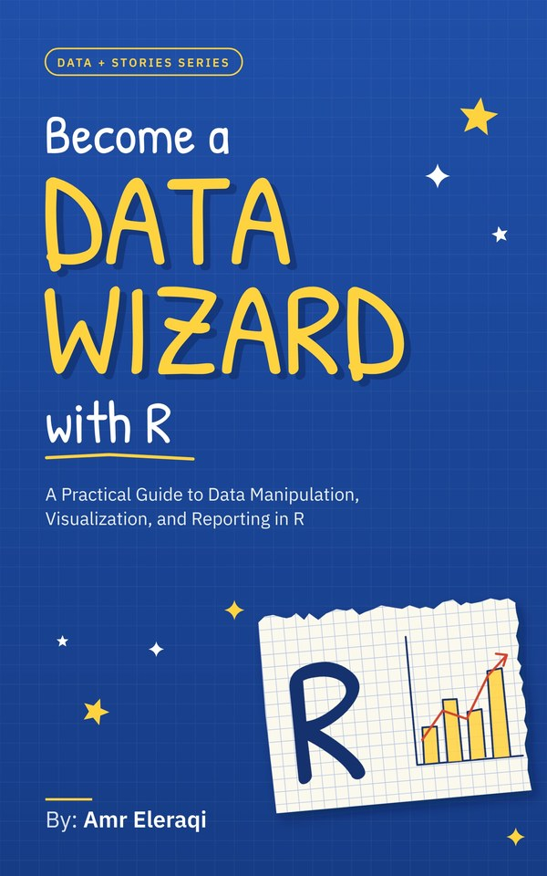

# Become a Data Wizard with R



Companion files for the book *Become a Data Wizard with R: A Practical Guide to Data Manipulation,
Visualization, and Reporting in R*, by Amr Eleraqi, part of the Data + Stories series.
Version of October 2026.

- Paperback: ISBN 9798160281216
- Hardcover: ISBN 9798160281926
- Kindle edition

These files are optional. The book is complete without them: every dataset comes with R
or with a package that Chapter 1 installs.

## Get the files

Download this repository as a zip file with the green **Code** button, or let R do it.
Run these lines in the console of the RStudio project you set up in Chapter 1:

```r
url <- "https://github.com/amr7772/data-wizard-r/archive/main.zip"
download.file(url, "companion.zip", mode = "wb")
unzip("companion.zip")
```

R unpacks the files into a folder called `data-wizard-r-main` inside your project.

## What is here

| Folder or file | What it holds |
|---|---|
| `scripts/` | The code of each chapter, in the order the chapter shows it, one file per chapter. Every script runs from top to bottom; code that the book shows but does not run, or that stops with an error on purpose, is commented out and marked. |
| `data/` | The files you write yourself in Chapter 3 (`afghanistan_formatted.csv`, `afghanistan_notes.xlsx`, `gapminder.csv`, `gapminder.rds`, `gapminder.xlsx`, `own_names.csv`, `own_names_latin1.csv`, `spellings_latin1.csv`) and the `storms.csv` file of Chapter 10. Put them in the `data` folder of your project, as Chapter 3 describes, and the code works unchanged. |
| `report/storm-report.qmd` | The finished report of Chapter 10. Copy it into the project folder that holds `data/storms.csv` and render it in RStudio, or run `quarto render storm-report.qmd` in the Terminal. |
| `exercise-sheets-A4.pdf` | The exercises of every chapter as sheets to print on A4 paper, with space for your code and your answers. The solutions are in Appendix 1 of the book. |

The CSV files hold only data, with no title row, because a title row would change what
the chapter's code reads. The book's title is in this file, in every script, and in the
properties of the Excel workbooks.

The code output in the book was produced with R 4.3.3 and the package versions listed in
"Before you begin." The code examples may be used freely in your own work.
